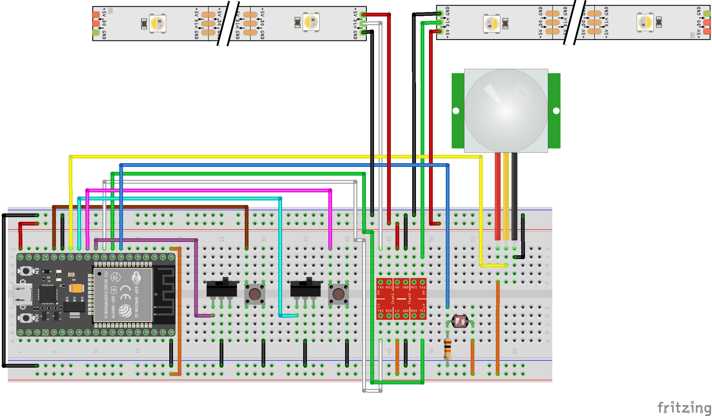

# Undercabinet Lights

Motion-sensing undercabinet kitchen lights.  Fades in bright during the day and dim during the night.

# Wiring

  
Created with [Fritzing](https://fritzing.org/).

# WiFi

On boot, an attempt will be made to connect to a WiFi network stored in memory.  
If that fails, the module will broadcast its own WiFi network to allow another device to connect to it and select a network to join.  
When compiling, replace WIFI_PASSWORD with a new password.  
SSID: **Under-Cabinet Lights**  
default password: **wifipassword**  

# OTA Programming

Generate public/private keypair in the sketch root directory (the same directory as the .ino):

```
openssl genrsa -out private.key 2048
openssl rsa -in private.key -outform PEM -pubout -out public.key
```

The default OTA password is **otapassword**.  