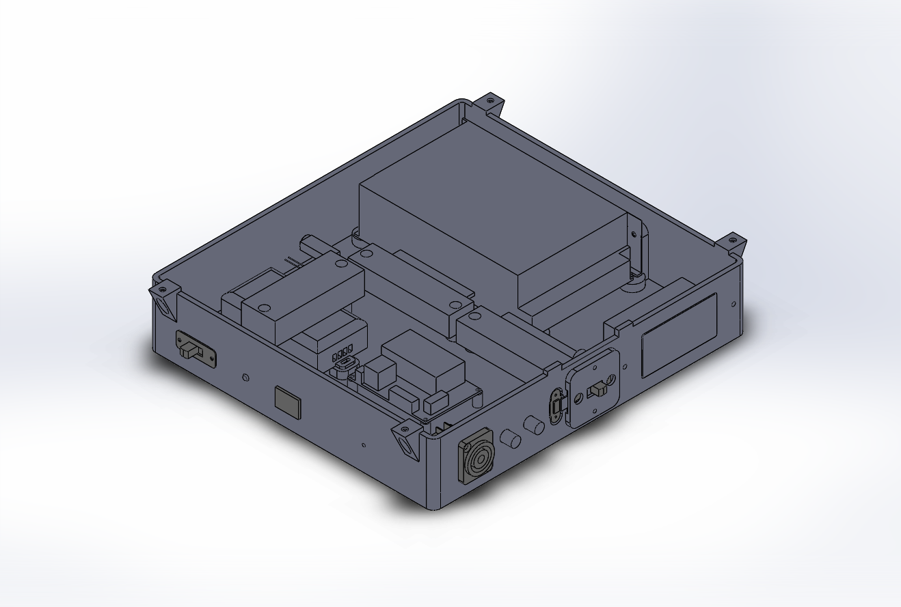

# Undercabinet Lights

Motion-sensing undercabinet kitchen lights.  Fades in bright during the day and dim during the night.  
A switch on the side toggles on party mode, where patterned lights are controlled by a phone app.  
The motion-sensing, brightness-sensing, light-fading normal mode is controlled by an ESP32.  
The color-changing party mode and phone app connection is controlled by an SP105E. 

# Assembled Enclosure

This assembly shows a rough representation of the components placed in the enclosure.  The enclosure will be mounted to the underside of a corner kitchen cabinet, positioned so that the PIR sensor and Photocell have a good view of the entire room.  
  
These objects were modeled in [Solidworks](https://www.solidworks.com/).  

* Front  
  
* Back  
  

# Parts to print  
  
  There are 3 parts to the enclosure which must be printed.  
  * Outer Box
      
  * Sliding cover for the USB port
      
  * Harness for the sliding cover
      

# Wiring

  
Created with [Fritzing](https://fritzing.org/).

# WiFi

On boot, an attempt will be made to connect to a WiFi network stored in memory.  
If that fails, the module will broadcast its own WiFi network to allow another device to connect to it and select a network to join.  
When compiling, replace WIFI_PASSWORD with a new password.  
SSID: **Under-Cabinet Lights**  
default password: **wifipassword**  

# OTA Programming

Generate public/private keypair in the sketch root directory (the same directory as the .ino):

```
openssl genrsa -out private.key 2048
openssl rsa -in private.key -outform PEM -pubout -out public.key
```

The default OTA password is **otapassword**.  